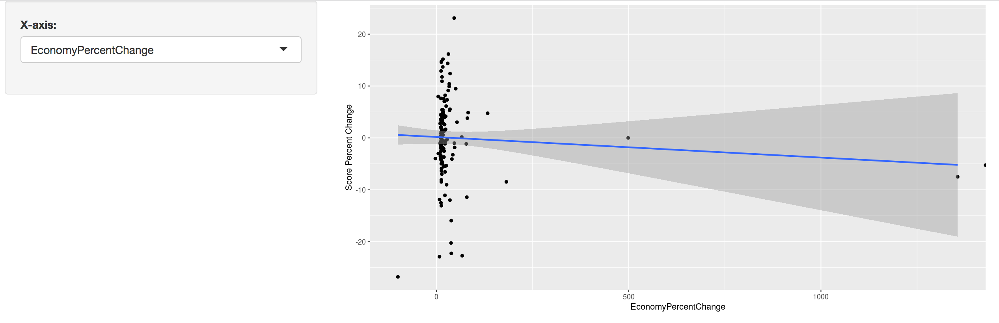

{#github-link}
```{r, echo=FALSE, message=FALSE, warning=FALSE}
# Set R Markdown chunk defaults:
knitr::opts_chunk$set(
  echo = TRUE, message = FALSE, warning = FALSE, 
  fig.width = 16/2, fig.height = 9/2
)
```

```{r}
library(tidyverse)
library(readr)
library(sf)
library(ggrepel)
library(leaflet)
```

# The Data
Our data for measuring world happiness comes from the United Nations Sustainable Development Solutions Network, in the form of their annual World Happiness Report , which is based on the happiness scores data from the Gallup World Poll. The scores range from 0 to 10,with 10 being the best possible life and 0 being the worst. These scores directly reflect a combination of current emotional reports and overall life evaluations. 

We also utilized shape files from [thethematicmapping.org](http://thematicmapping.org/downloads/world_borders.php).


# Happiness Score by Region

To further examine the change of happiness level numerically by each region of the world, this slope graph shows the average regional happiness scores and their changes from 2015 to 2017. The graph easily shows which region is the happiest place on earth compared to other regions in the world.


```{r}
happy2015 <- read.csv("world-happiness-report/2015.csv")
happy2016 <- read.csv("world-happiness-report/2016.csv")
happy2017 <- read.csv("world-happiness-report/2017.csv")

happyRank2015region <- happy2015 %>% 
  select(Country, Happiness.Score, Region) %>% 
  rename( "HappinessScore2015" = "Happiness.Score") %>%
  group_by(Region) %>%
  summarize(avgHappinessScore = mean(HappinessScore2015)) %>%
  mutate(year = 2015)

happyRank2016region <- happy2016 %>% 
  select(Country, Happiness.Score, Region) %>% 
  rename( "HappinessScore2016" = "Happiness.Score") %>%
  group_by(Region) %>%
  summarize(avgHappinessScore = mean(HappinessScore2016)) %>%
  mutate(year = 2016)

regionHelp <- happy2015 %>% select(Country, Region)

happyRank2017regionold <- happy2017 %>% 
  select(Country, Happiness.Score)

happyRank2017region <- inner_join(happyRank2017regionold, regionHelp, by = "Country") %>%
  rename( "HappinessScore2017" = "Happiness.Score") %>%
  group_by(Region) %>%
  summarize(avgHappinessScore = mean(HappinessScore2017)) %>%
  mutate(year = 2017)


happySlope <- rbind(happyRank2015region,happyRank2016region,happyRank2017region) %>%
  mutate(avgHappinessScore = round(avgHappinessScore,4))

```


```{r, fig.width=8, fig.height=10, message= FALSE}
# Creating A slopgraph
ggplot(data = happySlope, aes(x = year, y = avgHappinessScore, group = Region)) +
  geom_line(aes(color = Region, alpha = 1), size = 2) +
  geom_point(aes(color = Region, alpha = 1), size = 4) +
  geom_text_repel(data = happySlope %>% filter(year == "2015"),
                  aes(label = paste0(Region, " - ", avgHappinessScore)) , 
                  hjust = "left", 
                  fontface = "bold", 
                  size = 4, 
                  nudge_x = -.45, 
                  direction = "y") +
  geom_text_repel(data = happySlope %>% filter(year == "2017"), 
                  aes(label = paste0(Region, " - ", avgHappinessScore)) , 
                  hjust = "right", 
                  fontface = "bold", 
                  size = 4, 
                  nudge_x = .5, 
                  direction = "y")+
  scale_x_discrete(position = "top") +
  theme_bw() +
  theme(legend.position = "none") +
  theme(panel.border = element_blank()) +
  theme(axis.title.y = element_blank()) +
  theme(axis.text.y = element_blank()) +
  theme(panel.grid.major.y = element_blank()) +
  theme(panel.grid.minor.y = element_blank()) +
  theme(axis.title.x     = element_blank()) +
  theme(panel.grid.major.x = element_blank()) +
  theme(axis.text.x.top = element_text(size=12)) +
  theme(axis.ticks= element_blank()) +
  labs(
    title = "Change in Average Happiness Score by Region")

```
According to the slope graph Australia and New Zealand, North America, Western Europe, and Latin America and Caribbean were the happiest regions in 2015, and remained the top four happiest regions on earth. Southern Asia and Sub-Saharan Africa remained the two least happy regions, regardless of their score fluctuations. The happiness scores of Eastern Asia, Middle East and Northern Africa, Central and Eastern Europe, and Southeastern Asia were relatively close to each other from 2015 through 2017, although Southeastern Asia surpassed Central and Eastern Europe and Middle East and Northern Africa with a slight growth in its happiness score. 

In general, Africa and Asia still suffer from a range of issues, including overpopulation, pandemics and emerging diseases, poverty, hunger to political oppressions, economic downturns and military conflicts. The western hemisphere, which has benefited from hundreds of years of capital accumulation and democratic progress, continues to thrive and manage to keep its top spot of being the happiest place region for their people to live in.


# Shiny Application

Other than focusing on the final happiness scores, the World Happiness Report also provides the breakdown scores of five individual factors and Dystopia which offers insights to the “truth” of happiness, specifically how the change in factors contribute to the change of the overall happiness score. To explore how these effects, click on the picture below to access an interactive shiny application. You can switch between seven different scatterplots, which show the relationship between a percent change in factor and a percent change in happiness score from 2015 to 2017. These factors include: Economy which represents the economic production in terms of GDP, Family which stands for social support, Health which weighs on life expectancy, and Trust describes an absence of corruption. There is also the Dystopia variable. Dystopia is an imaginary country with the least happiest people, offers a benchmark for all countries to be favorably compared in terms of positive values for the previous six key factors. The dystopia variable represents the amount of happiness score that can’t be described by the other factors.  

[](https://andrea-lynn-rawson.shinyapps.io/FinalProjectInteractiveGraph/)


Comparing the six scatter plots altogether, it appears that love actually is the most important factor for happiness because Family(social support) score implies the strongest positive correlation with the overall happiness score; the more social support people receive, the happier they will be. Freedom, Trust and Generosity also shows a positive correlation with happiness as they commonly represent as positive factors that fulfill people’s lives. However, the effect of Generosity may be confounded by an outlier. On the other hand the scatter plots for Economy and Health display a negative correlation.  Like Generosity however, the relationship between Economy and Health, and happiness both seem to be affected by outliers. 


# Conclusion
Overall, looking at all three visualizations, it appears that while there may have been large percentage changes in happiness in some countries, as regions happiness scores did not change much between 2015 and 2017. Looking at the percent change in the factors making up the happiness score can be informative for some factors, such as Family, Freedom and Trust, but many of the relationships between the factors and percent change in happiness score are strongly affected by outliers, making the apparent relationship unreliable. 

Although the data provides a logical and consistent analysis on happiness, some critics have questioned the legitimacy of these standards, for the reason that happiness itself is subjective. Africa has continuously been ranked as the least happiest continent, but are African people truly unhappy, or just unhappy by the World Happiness standard? While this data does provide some insights into where in the world is the happiest and why, it does leave something to be desired, as the criteria were created in a western country, and may not reflect happiness in the same way that other cultures experience it. 

